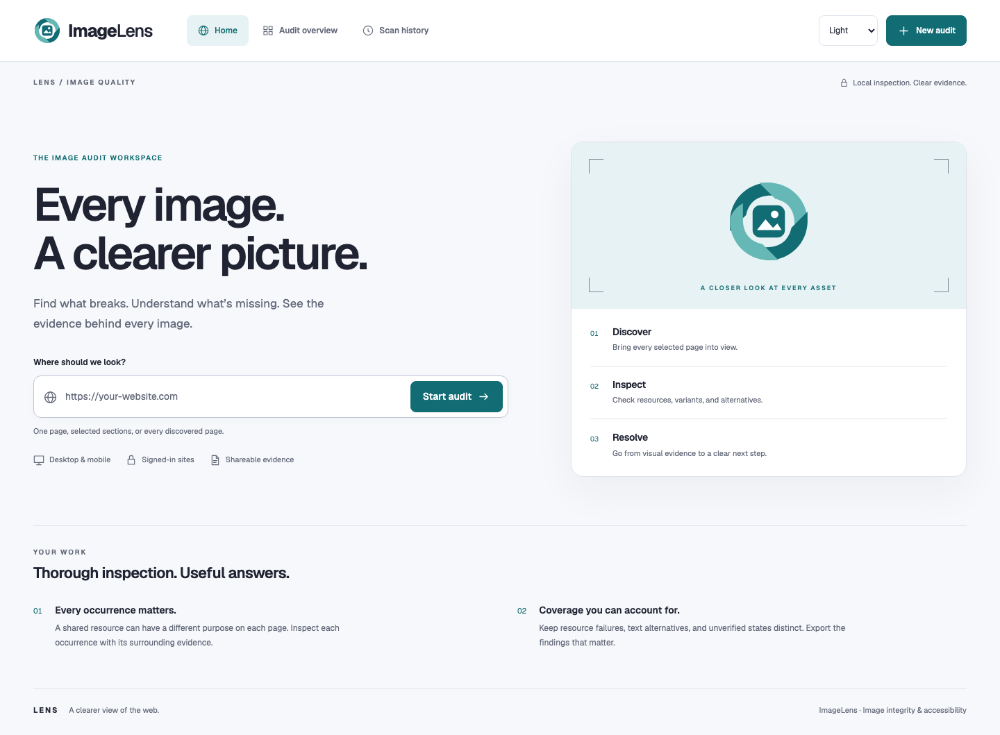
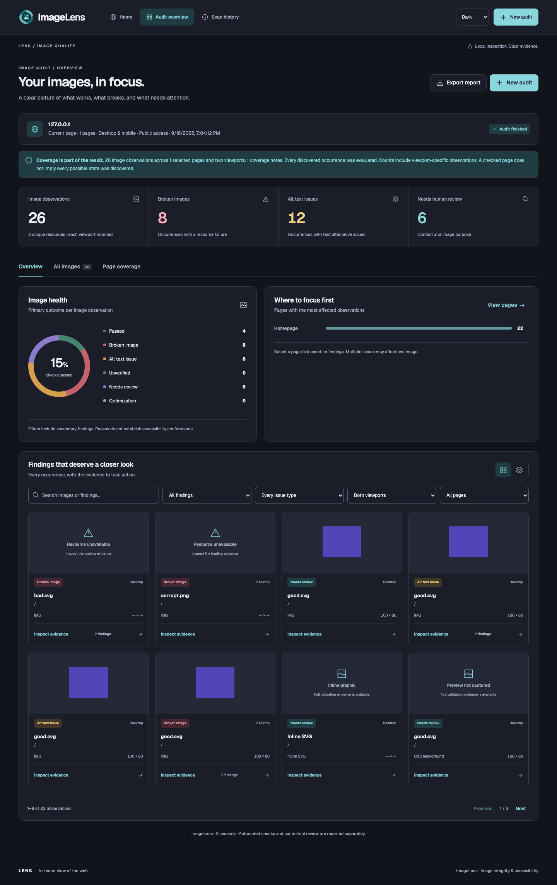
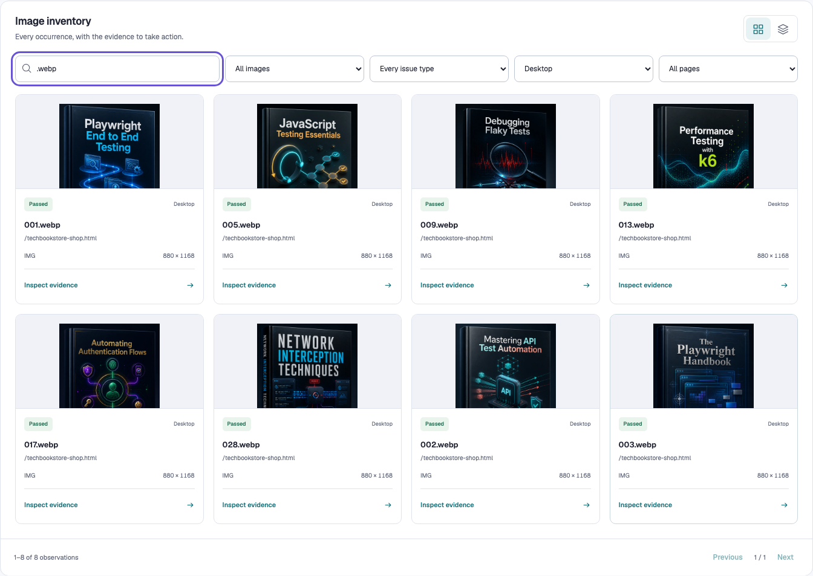
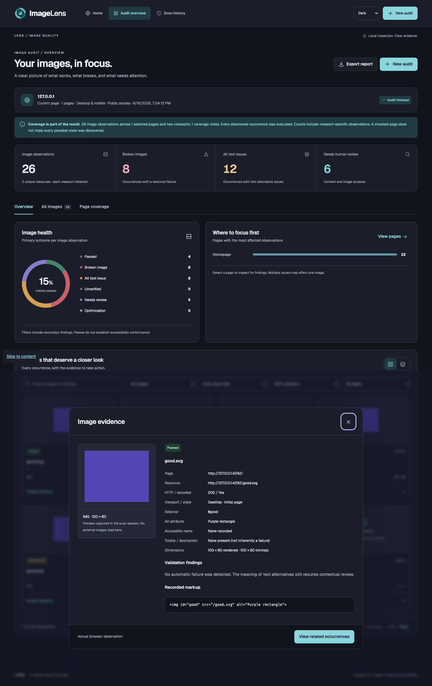
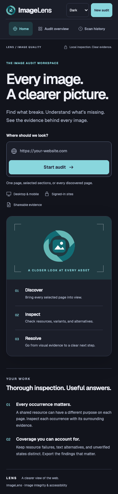

<div align="center">
  
  <h1>ImageLens</h1>
  <p><strong>Every image. A clearer picture.</strong></p>
  <p>Find broken images and common image accessibility issues across web pages.</p>
  <p>
    <a href="#installation">Installation</a> ·
    <a href="#how-to-use-imagelens">How to use</a> ·
    <a href="#reports">Reports</a> ·
    <a href="#testing">Testing</a>
  </p>
  <sub>Version 1.0.0 · Node.js 20+ · Playwright with Chromium</sub>
  <p>
    <a href="CHANGELOG.md"></a>
    <a href="#requirements"></a>
    <a href="#testing"></a>
    <a href="docs/demo/index.html"></a>
  </p>
</div>

---

## About ImageLens

ImageLens checks images on web pages in a real browser. It finds broken images, missing alternative text, responsive image problems, and other common issues.

Each finding includes useful details such as the page URL, image source, screen size, HTML element, and captured preview when available. This helps developers, testers, accessibility specialists, and content teams understand and fix problems.

ImageLens can scan public pages and pages that require sign-in. It runs on your computer and supports desktop and mobile screen sizes.

## The LENS Trio

The LENS Trio shares a visual system and an evidence-first approach across three focused quality tools.

| Product | Focus | Repository |
| --- | --- | --- |
| **A11yLens** | Accessibility audit evidence, issue triage, element inspection, and coverage review | [github.com/manjunathnp/A11yLens](https://github.com/manjunathnp/A11yLens) |
| **LinkLens** | Link integrity, destination verification, access conditions, and navigation evidence | [github.com/manjunathnp/LinkLens](https://github.com/manjunathnp/LinkLens) |
| **ImageLens** | Image integrity, responsive resources, text alternatives, and visual evidence | [github.com/manjunathnp/ImageLens](https://github.com/manjunathnp/ImageLens) |

## Screenshots

### Home



### Results and image gallery



### Tech Book Store Book Covers



<table>
  <tr>
    <td width="70%"><strong>Image details</strong></td>
    <td width="30%"><strong>Mobile view</strong></td>
  </tr>
  <tr>
    <td></td>
    <td></td>
  </tr>
</table>

These screenshots show a fresh scan of **Tech Book Store**, a local practice storefront, at `http://127.0.0.1:4400/techbookstore-shop.html`. The public catalog page was inspected in desktop and mobile viewports using seeded book data. See [capture provenance](docs/screenshots/capture-provenance.json), the [product demo](docs/demo/index.html), and the [exported report](docs/demo/tech-book-store-report.html).

The captured ImageLens run records 48 image observations, all passing its automated checks. The report keeps supporting evidence available for broader accessibility review.

## Main features

- Scan the current page, all discovered pages, or a selected list of pages.
- Scan public websites or sign in through a browser opened by ImageLens.
- Check desktop and mobile views.
- Find standard images, responsive images, CSS background images, inline SVGs, lazy-loaded images, open shadow DOM, and accessible frames.
- Find broken sources, loading errors, decoding errors, HTTP errors, and empty image sources.
- Find missing alt text, tooltip-only descriptions, unnamed image buttons, generic text, and unusually long text.
- Review images in a gallery or list and open each finding for more details.
- Filter results by status, issue, page, screen size, or search text.
- Export reports as HTML, PDF, CSV, or JSON.
- Use light, dark, or system theme.
- Recover an active scan after refreshing the page.

## Requirements

- Node.js 20 or newer
- npm
- macOS, Linux, or Windows

ImageLens uses Playwright and Chromium to open and check real web pages. You do not need to install Playwright globally. The installation steps below add it only to this project.

## Installation

```bash
git clone https://github.com/manjunathnp/ImageLens.git
cd ImageLens
npm install
npx playwright install chromium
npm start
```

Open [http://127.0.0.1:4190](http://127.0.0.1:4190) in your browser.

The `npx playwright install chromium` command downloads the browser used by the scanner. You usually need to run it only once.

To use a different port:

```bash
PORT=4200 npm start
```

ImageLens is available only on your computer at `127.0.0.1`.

## How to use ImageLens

1. Enter a website or page URL.
2. Choose public access or sign in through the browser opened by ImageLens.
3. Choose the pages you want to scan.
4. Review the selected pages and start the scan.
5. Use the summary, charts, filters, gallery, and image details to review the results.
6. Export the report as HTML, PDF, CSV, or JSON.

For a website that requires sign-in, use a test account when possible. Enter your credentials only in the website opened by ImageLens. Return to ImageLens after sign-in and confirm that the session is ready.

## Checks

| Area | What ImageLens checks |
| --- | --- |
| Image loading | Empty sources, failed downloads, decoding errors, HTTP errors, corrupt files, and lazy-loaded images |
| Responsive images | `srcset`, `picture`, fallback sources, and problems that appear only at a certain screen size |
| Alternative text | Missing or empty `alt`, accessible names, tooltip-only text, unnamed image controls, generic text, and very long text |
| Image quality | Original and displayed sizes, possible low-resolution images, and file-size information when available |
| Other image types | Inline SVG, CSS backgrounds, pseudo-elements, open shadow DOM, and accessible frames |
| Scan coverage | Pages and screen sizes checked, exploration boundaries, timing outcomes, and focused follow-up items |

An image can have more than one issue. ImageLens shows a main result for the summary and keeps all issues in the detailed view and exported report.

## Reports

| Format | Best for |
| --- | --- |
| **HTML** | An interactive report with filters, image details, and CSV download |
| **PDF** | A report that is easy to print or share |
| **CSV** | Reviewing and sorting results in a spreadsheet |
| **JSON** | Using the complete scan data in another tool or workflow |

Reports can contain page URLs, HTML details, and image previews. Review a report before sharing it.

## Privacy

- ImageLens runs locally and listens only on `127.0.0.1`.
- The ImageLens screen does not ask for or save your sign-in details.
- Sign-in browser sessions stay in server memory and expire after 30 minutes without activity.
- The browser stores the latest ten completed scans.
- Restarting the server clears unfinished jobs.
- Scanning a website sends normal browser requests to that website. Scan only sites you are allowed to test.

## Scan Scope and Coverage

- Each run can discover up to 200 pages and maintain a queue of up to 3,000 links.
- Per-page exploration includes up to 24 scroll steps, 16 supported interactions, and 18 recorded states for predictable reviews.
- Page loading uses a 20-second response window, while image decoding uses a 7-second window and records resources for follow-up when needed.
- “All pages” represents every page ImageLens discovers during the selected run, with page and viewport coverage preserved in the report.
- Mobile mode adds a focused small-viewport perspective; teams can extend it with physical-device and cross-browser testing when those environments matter.
- Coverage notes highlight content such as closed shadow roots, canvas elements, custom controls, and complex sliders for targeted follow-up.
- Preview status remains separate from image-health evidence, so browser capture behavior stays clear in the review.
- Automated text-alternative checks provide evidence that teams can pair with a human review of meaning and context.

## Testing

The project includes automated tests for the scanner, interface, reports, recovery, themes, keyboard use, accessibility checks, and responsive layouts.

```bash
npm test
npm run test:scenarios
npm run test:design
```

Automated accessibility tests help find interface problems and complement focused manual review of the complete experience.

## Project files

```text
ImageLens/
├── app.js                     # App interface and reports
├── server.js                  # Local server and scan jobs
├── index.html                 # Main page
├── styles.css                 # App styles
├── lens-tokens.css            # LENS colors and design settings
├── theme.js                   # Light and dark theme settings
├── src/
│   ├── authentication.js      # Sign-in session checks
│   └── scanner.js             # Page discovery and image checks
├── tests/                     # Automated tests
├── brand/                     # ImageLens logo
├── assets/fonts/              # Local font files and license
└── docs/screenshots/          # README screenshots
```

## Development

ImageLens uses HTML, CSS, JavaScript, Node.js, Playwright, and Chromium. There is no frontend build step.

```bash
npm start                 # Start ImageLens on port 4190
npm test                  # Run scanner and app tests
npm run test:scenarios    # Run recovery and unusual workflow tests
npm run test:design       # Run theme, keyboard, and responsive design tests
```

Test files are saved in `test-output/` and are not added to Git.

> [!IMPORTANT]
> ImageLens provides detailed automated checks and evidence. Pair the results with a human review to confirm that alternative text clearly communicates each image's purpose and context.

## Release history

See [CHANGELOG.md](CHANGELOG.md) for release notes.

## License

Copyright © 2026 Manjunath N P. All rights reserved. See [LICENSE.md](LICENSE.md).
